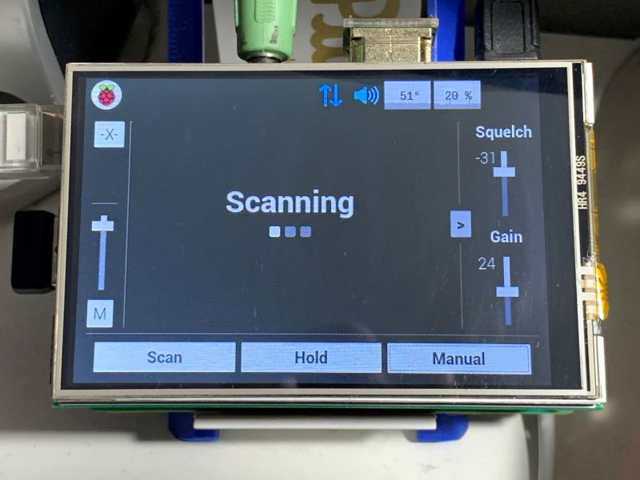

# PiScan
This software can take a Raspberry Pi (or another embedded computer) and turn it into a radio scanner. With only a $40 Pi and a $20 RTL-SDR dongle, you can build an inexpensive scanner with the capabilities of much more expensive equipment (at least that's the goal for this).

## License
A license hasn't been selected yet, though it's likely to be GPL - have to make sure there won't be issues down the line when trunking is added
## Features
 - System scanning
	* Traverses through a JSON list of frequencies
	* Sorts channels into chunks of bandwidth to maximize scanning performance
- Manual frequency entry
- CubicSDR-based demodulator (built on liquid-dsp)
- Configurable squelch and tuner gain
- Configurable logging
- Remote control through TCP
- Remote monitoring with RTSP

## To-Do
#### Short-term (before the first beta):
- Replace TCP connection with WebSockets and possibly HTTP
- CTCSS, DCS support
- AM demodulation
- Run-time manipulation of scan database and config
- Temporary channel lockout
#### Long term:
- P25 trunking
- DMR trunking
- Broadcastify interfacing

## System requirements
- Linux OS - Debian or Ubuntu based distros recommended (untested on other distros - scripts are only configured for Debian builds)
- CPU with 2+ cores
	* ARM: will work on at least an RPi 2B (900MHz BCM2836)
	* x86: should run well on most modern low-power CPUs, has been tested on dual-core Atom-class processors without maxing out the CPU
- RAM: memory usage hasn't been officially profiled, but at least 256MB is probably a sufficient minimum
- Disk space: 10MB is sufficient for the source, binaries, and data files, but more space will be needed depending on the verbosity you choose for the logfiles.
- Additional Raspberry Pi notes
	* At least a small heatsink on the SoC is necessary, since the CPU will be under load for extended periods
	* Sufficient power delivery is required (the official power adapter for example) - power issues will cause the CPU to downclock resulting in poor performance
## Setup - Build from Source
PiScan is supported and has been tested on Debian-based systems (including Raspbian and Ubuntu).

### Prerequisites
The following packages need to be installed, if not already:
    
    g++
    git
    build-essential
    cmake
    libboost-all-dev
    libliquid1d, libliquid-dev
    libsoapysdr-dev, soapysdr-module-rtlsdr
    librtlsdr0
    libpulse-dev, libasound2-dev, libjack-dev
    protobuf-compiler, libprotoc-dev
    libssh-dev

Installation can automatically be done with:

	sh ./install_prereqs.sh

### Initializing 
In a terminal, download the source with the command:

	git clone https://github.com/ezratl/PiScan
Then configure the environment:

	sh ./configure_make
Or

	sh ./configure_ninja
Depending on your preferred build system

There are three options available for audio output: PulseAudio, ALSA, JACK, and OSS. By default ALSA is the selected library. Your preference can be set by running one of the following commands from the `build` directory:

	cmake .. -DUSE_AUDIO_PULSE=ON
	cmake .. -DUSE_AUDIO_ALSA=ON
	cmake .. -DUSE_AUDIO_JACK=ON
Do note that PulseAudio uses significantly more CPU than ALSA when streaming PiScan audio.

Additionally, some versions of liquid, particularly `libliquid2d` and `libliquid-dev` versions `1.3.2` and greater, have a different API, resulting in build errors in the "Modem" files of the `cubic` module. If that happens, try running this from `build`:

	cmake .. -DLIQUID_API_OLD=OFF
### Building
Once the environment is properly configured, `cd` into `build` and build the LiveMedia library:

	make live555
If the build fails: If you are building in a shared folder in a VM on a Windows host, you must download and extract the Live sourcefiles manually into `src/external/live` and run the command below before trying again. This is due to Windows not playing nicely with permissions and symbolic links

	cmake .. -DHGFS=ON
Now you can build PiScan:

	make all
Alternatively, you can build the binaries individually if you don't need all of them

	make piscan_server		# main program
	
	make piscan_hpdconv		# tool to convert Uniden Sentinel files to PiScan files
Once the build is complete, you can run the install script:

	sudo make install
Note: install must be re-run if the project is rebuilt

### Running
PiScan can now be run with the command:

	piscan_server [args]
See **Usage** for more information on command arguments and setting up the data files 

Alternatively, if you prefer not to use `make install` you can run it locally from the `build` directory with the command:

	./src/piscan_server [args]

## Usage
### Command Arguments
`-v [0-9]`: stderr log verbosity. Note this does not effect generated logfiles
`-f [0-9]`: Logfile verbosity - overrides saved config
`-d`: Run with debug interface. This is very user-unfriendly, so interfacing through the client program is recommended
`-p [path]`: load data from `path` rather than the default directory. Helpful for running multiple PiScan instances
### Config and Data
All data used by PiScan is stored in its working directory (this is the `data` directory for alpha builds). It contains a few JSON files as well as a folder for logfiles.
	- `config.json` contains all settings that can be modified by the user
	- `state.json` is used by the program to maintain its stately data between runs
	- `systems.json` contains the scan database - more on what that looks like below
On the first run of PiScan, these files likely won't exist. It will continue running with default parameters, and a config and state file will be generated with these defaults when the program ends.
If there is no scan file, PiScan cannot scan so it will instead hold at 100MHz. It will not allow the user to scan, but will allow manual frequency tuning.

#### SDR configuration
PiScan allows for configuring specific RTL dongles to run with it. By default, it doesn't have any pre-configured SDR's, so it will select the first available device and save it to the config file. One it's in the config file it will be given a rank (for specifying the order PiScan chooses from configured devies) and a descriptor, which contains the device name and serial number. There, the dongle's PPM correction and preferred sample rate can be set. The format of each device config is as such:

	{
		"rank": "0",
		"descriptor": "Generic RTL2832U OEM :: 00000001",
		"driver": "rtlsdr",
		"ppm_correction": "0",
		"sample_rate": "2048000"
	}

#### Scan Database File
`systems.json` MUST adhere to this format (minus the comments) for PiScan to read it correctly. Use the sample file in `data/defaults` as a starting point for your database if writing it manually.

	{
		"systems": [
			{
				"systype": "analog",				<- available types: analog
				"tag": "Sample System",
				"lockout": false,					<- persistent system lockout
				"channels": [
					{
						"tag": "FM entry - CSQ",
						"lockout": false,			<- persistent channel lockout
						"delay": 2000,				<- scan resume delay in milliseconds
						"freq": 453150000,			<- frequency in Hz
						"chantype": "fmc"			<- available types: fmc, amc, plc, dcc
					},
					{
						"tag": "FM entry - PL",
						"lockout": false,
						"delay": 2000,
						"freq": 471837500,
						"chantype": "plc",
						"tone": "103.5"				<- stored as string rather than a float
					},
					{
						"tag": "FM entry - DCS",
						"lockout": false,
						"delay": 2000,
						"freq": 460287500,
						"chantype": "dcc"
						"code": "023"				<- stored as string rather than an int
					}
				]
			}
		]
	}
Do note that since PL and DC squelch are not yet supported, they will be squelch like a CSQ channel.

A scan file can be generated from an `.hpd` file, which is a plaintext format used by Uniden Sentinel to store favorites lists on a PC - this can be found in `Documents/Uniden/BCDx36HP/FavoriteLists`. To generate, run:

	build/scan/piscan_hpdconv -i <path_to_hpd_file> -o <directory_for_output_file>
A generator for CSV input will probably come soon, followed eventually by a GUI editor
### Interfacing
The primary way to interact with PiScan is through the [client program](client/). Guides on its usage can be found there.
In short, it communicates through a TCP connection, with a default port 1234.

To listen to PiScan's audio feed remotely without the client, use a stream client that supports RTSP, such as VLC, and enter the MRL `rtsp://<host_address>:8554/audio`. Setting a low network caching time is advised to reduce audio latency.

## Troubleshooting
If build errors are occuring with ModemAM.cpp or similar sources, the LIQUID_API_OLD CMake flag needs toggled. Generally it needs to be set to OFF for liquid versions >= 1.3.2, but swapping its value may help in other cases.

## Disclaimer
This is a personal project; it lacks both the design standards and testing standards of commercially-built software, meaning no guarantees can be made of its reliability. Use at your own risk.

Do not expose the ports used by this software directly to the internet! The TCP connection has no security whatsoever, and although a more secure replacement is planned, the robustness of the software has not been tested.
