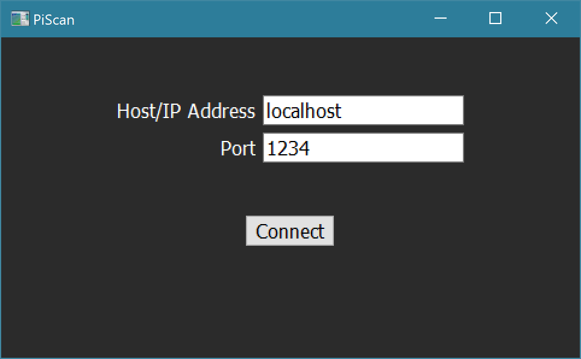

# PiScan Client
This is the client program used to control the [PiScan software](https://github.com/ezratl/PiScan)
Currently, this repo contains only the cross-platform Python GUI client. Goals for the future include an Android client and an iOS client.
## Python GUI
This client is compatible with any system that has a desktop interface supported by Qt (Windows, macOS, Linux)
To use it, clone this repo in a directory of your choice, then navigate to the `py` directory.

First, install the prerequisites:

	pip3 install -r requirements.txt
Then you can run it from there:

	python3 ./client.py
For the time being, the script needs to be run from the `py` directory, otherwise it will not be able to locate its resource files and fail to run.

The following command options are available:
`-l`: Bypasses the connect dialog and connects to PiScan on localhost
`-a <host>`: Specify the address of the system where PiScan is running (e.g. localhost). Using this option bypasses the connection dialog.
`-p <port>`: Specify the port to use if it's other than the default (1234). Only necessary in conjunction with `-a`
`-w`: Starts client maximized with title bar hidden. Intended to be used on a Raspberry Pi with a 3.5inch display
### Interface
#### Connecting
The connect dialog will appear on opening, if an address wasn't already specified. Here you can specify an address and port, which by default are localhost and 1234. 

Once you hit the `Connect` button it will attempt to connect to PiScan. Once successful, you will be presented with the scanner screen.
#### Scanning
 

Buttons:
- `Scan`: resumes scanning from a paused state
- `Hold`: pauses scanning on the currently active channel or whatever channel the scanner is currently checking
- `Manual`: opens a dialog to manually tune to a frequency
- `Settings` is disabled; it's a placeholder for functionality that hasn't been implemented

Right sidebar:
- The squelch slider's range is set by the PiScan it's connected to. By default, the value will be in dBm
- The gain slider sets the tuner gain. The default it automatic gain, but can be set in a range of 0-50
- The grey button left of the sliders will collapse/open the sidebar, to hide the sliders when they are not needed
#### Manual Entry
The dialog gives a text field to enter a frequency in MHz, as well as a drop down containing the modulations supported by the connected PiScan instance. Clicking `Tune` will request PiScan to tune to the manual channel you specified. If all the parameters are valid, it will hold and monitor the manual channel.

