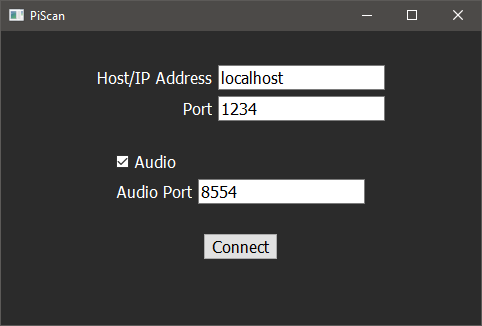
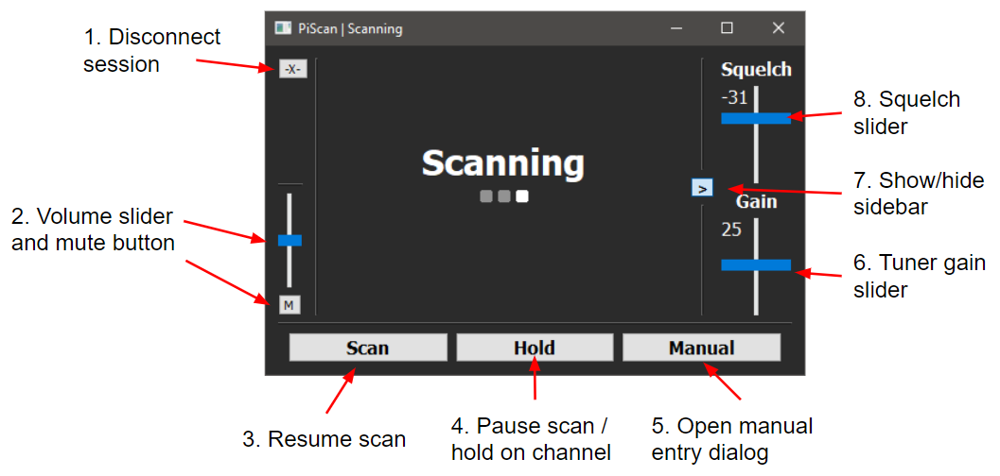
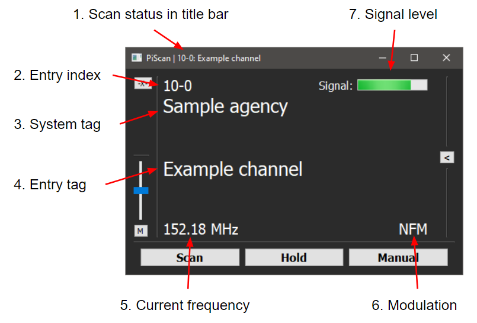
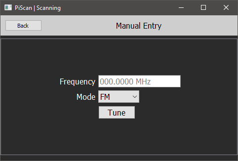
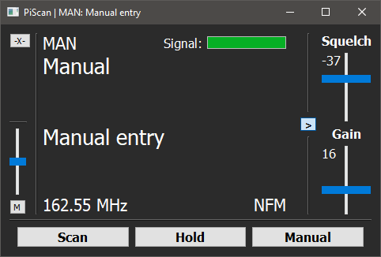

# PiScan Client

This is the client program used to control the [PiScan software](https://github.com/ezratl/PiScan)

Currently, this repo contains only the cross-platform Python GUI client. Goals for the future include an Android client and an iOS client.

## Python GUI
This client is compatible with any system that has a desktop interface supported by Qt (Windows, macOS, Linux)
To use it, navigate to the `py` directory.

**Python 3 is required to run the GUI**

First, install the prerequisites:

	pip install -r requirements.txt

If you are on Linux, you may also have to install these packages through the system package manager:

	python3-pyside2.qtcore
	python3-pyside2.qtgui
	python3-pyside2.qtuitools
	python3-pyside2.qtwidgets
	python3-pyside2.qtxml
	python3-vlc

Then you can run it from there:

	python ./client.py
For the time being, the script needs to be run from the `py` directory, otherwise it will not be able to locate its resource files and fail to run.

The following command options are available:

`-a <host>`: Specify the address of the system where PiScan is running (e.g. localhost). Using this option bypasses the connection dialog.

`-p <port>`: Specify the port to use if it's other than the default (1234). Only necessary in conjunction with `-a`

`-s`: Used with previous options. Using this will connect to the RTSP audio stream (default no audio)

`-r`: Used with previous options. Specify the port for the RTSP stream if othern than the default (8554)

`-l`: Bypasses the connect dialog and connects to PiScan on localhost. Audio stream is not automatically connected.

`-w`: Starts client maximized with title bar hidden. Intended to be used in an embedded application such as a Raspberry Pi with a 3.5inch display

### Interface
#### Connecting

The connect dialog will appear on opening, if an address wasn't already specified. Here you can specify an address and port, which by default are localhost and 1234. If `Audio` is checked another text box will appear to specify the port for the RTSP audio stream, which is 8554 by default.

Once you hit the `Connect` button it will attempt to connect to PiScan. Once successful, you will be presented with the scanner interface.
#### Scanning

Left sidebar:

1. Disconnect session: Will disconnect you from the PiScan server and return you to the connection dialog
2. Volume slider and mute button: Adjusts volume if audio is enabled. Will be hidden if the audio stream is not connected.

Control Buttons:

3. Scan: resumes scanning from a paused state
4. Hold: pauses scanning on the currently active channel or whatever channel the scanner is currently checking
5. Manual: opens a dialog to manually tune to a frequency

Right sidebar:

6. The gain slider sets the tuner gain. The default it automatic gain, but can be set in a range of 0-50. The current value is displayed top left of the slider.
7. The grey button left of the sliders will show or hide the sidebar, to hide the sliders when they are not needed.
8. The squelch slider's range is set by the PiScan it's connected to (depending on the configured squelch method). By default, the value will be in dBm. The current value is displayed top left of the slider.

#### Monitoring

1. Title bar: "Scanning" will be displayed while actively scanning, the entry index and entry tag will be displayed while paused. Useful if the client is minimized.
2. The index of the current entry in a `[system number]-[channel number]` format. Will display `MAN` when in manual tuning mode.
3. The tag of the current entry's system.
4. The tag of the current entry
5. The current tuned frequency being monitored
6. The modulation of the entry - will display the entry's code if a code squelch is used (PL tone for example)
7. The strength of the signal on the frequency being monitored, relative to the signal floor and ceiling

#### Manual Entry
The dialog gives a text field to enter a frequency in MHz, as well as a drop down containing the modulations supported by the connected PiScan instance. Clicking `Tune` will request PiScan to tune to the manual channel you specified. If all the parameters are valid, it will hold and monitor the manual channel.

Once tuned, channel will appear as a regular entry with index `MAN`, system `Manual` and tag `Manual entry`, as well as the selected frequency and modulation.

